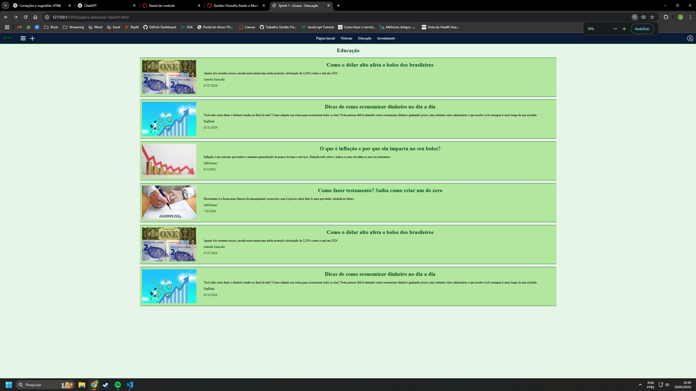
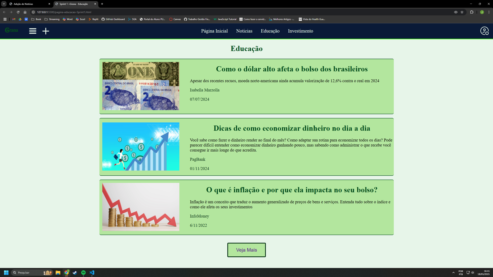
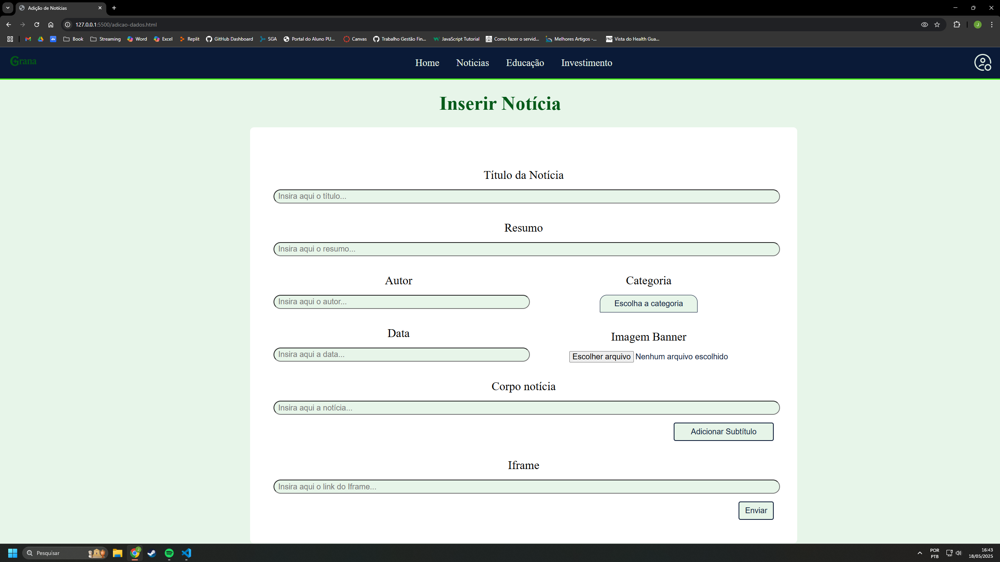
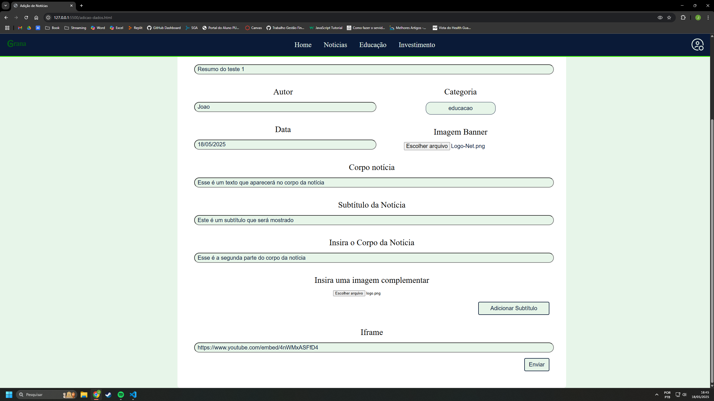
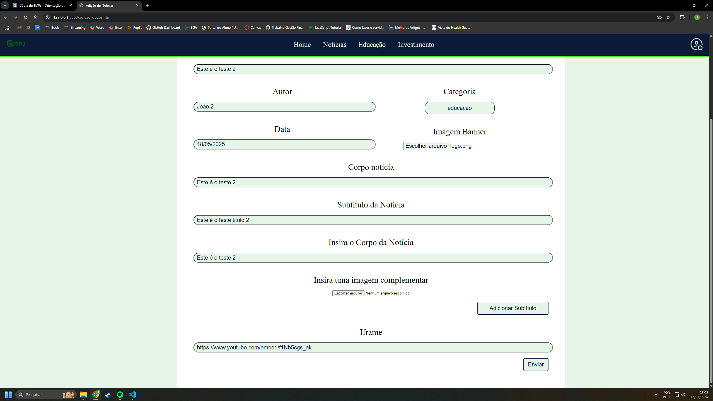
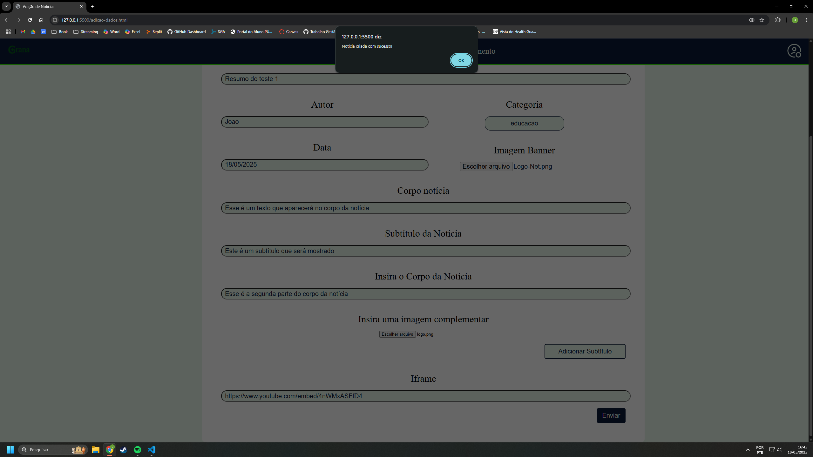
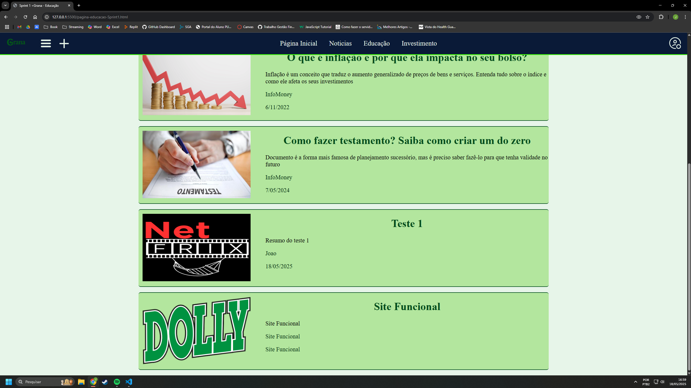
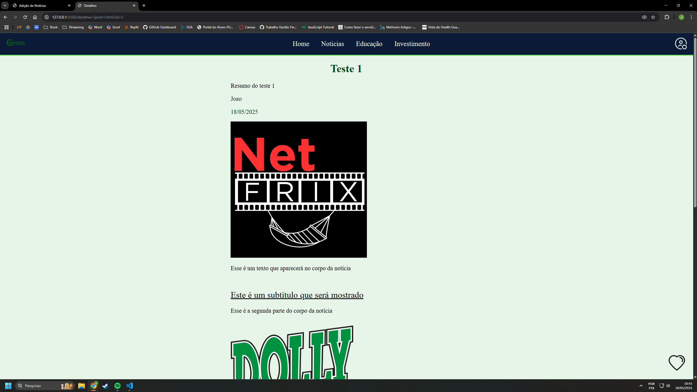
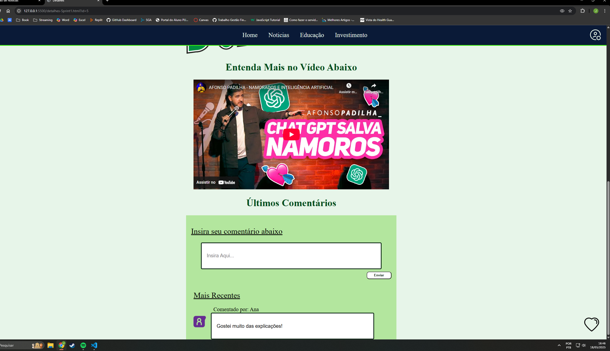

# Sprint 2 #

Aluno: João Vitor Alves Amaral
Matrícula: 882594
Turma: Sistemas de Informação
Turno: Noite
Grupo: +Grana
Projeto: Gestão Financeira
Parte: Criação da página de criação de notícias, educativas ou de investimento (para do administrador da página).

Obs: A Sprint 1 foi adicionada a esse trabalho para que possa de fato ser feita a adição de noticias e das informações, portanto, os arquivos que estão com Sprint1 na frente não devem ser considerados

Obs2: As adições só são possíveis no localStorage, para verificar se a adição está funcionando corretamente, após enviar a notícia, confirme em "aplicação" nas ferramentas do desenvolvedor

# # 

# #

# #

# #

# #

# #

# #

# #

# #
